# n8n Google Credential 인증 설정 가이드

## 📝 개요
n8n에서 Google 서비스와 연동하기 위한 credential 인증 방법을 정리한 가이드입니다.  
크게 **OAuth 방식**으로 인증합니다.

---

## 🔐 1. OAuth 방식 

### ✅ 사전 준비
- Google 계정
- Google Cloud Console 접근 권한
- n8n 인스턴스 (Self-hosted)

### 📋 단계별 진행

#### 🚀 단계 1: Google Cloud Console 프로젝트 생성
1. [Google Cloud Console](https://console.cloud.google.com/)에 접속 및 서비스 약관 동의
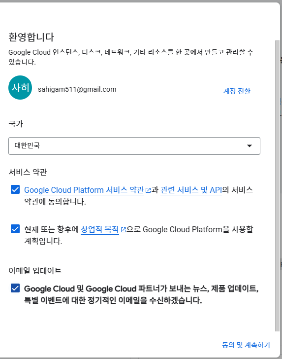
2. 프로젝트 선택 - 새 프로젝트

3. 프로젝트 이름 설정
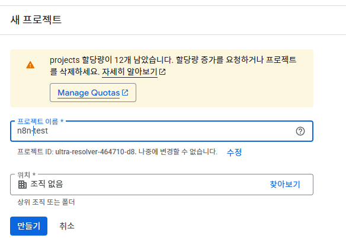
#### 🔧 단계 2: API 활성화
1. 좌측 메뉴에서 `APIs & Services > Library` 이동
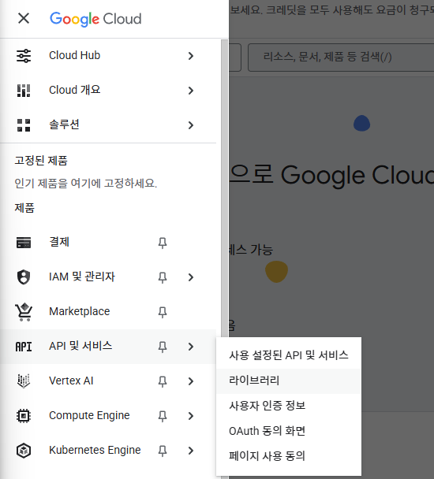
2. 사용하려는 Google 서비스 API 검색 및 활성화
   - Google Calendar API

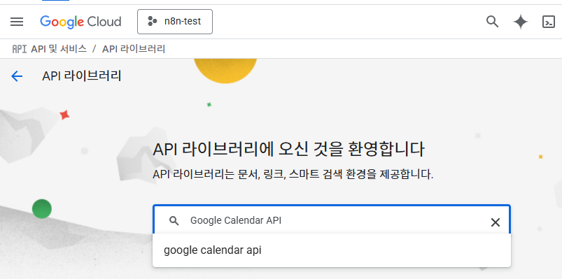
> 필요한 라이브러리 검색

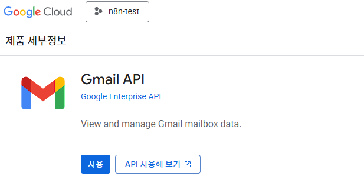
> API 사용을 클릭
동일한 방식으로 하나씩 등록합니다
   - Gmail API
   - Google Drive API
   - Google Sheets API 
   - Google Slide API
   - Google docs API

#### 🛡️ 단계 3: OAuth 동의 화면 구성
1. `APIs & Services > OAuth consent screen` 이동
- 기본 인증정보를 셋팅하는 단계입니다. 프로필 셋팅 같은 것이죠
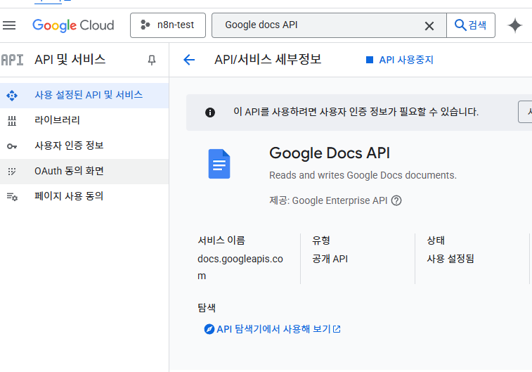
> 네번째 OAuth동의화면으로 이동
2. **Get started** 클릭하여 OAuth 동의 구성 시작
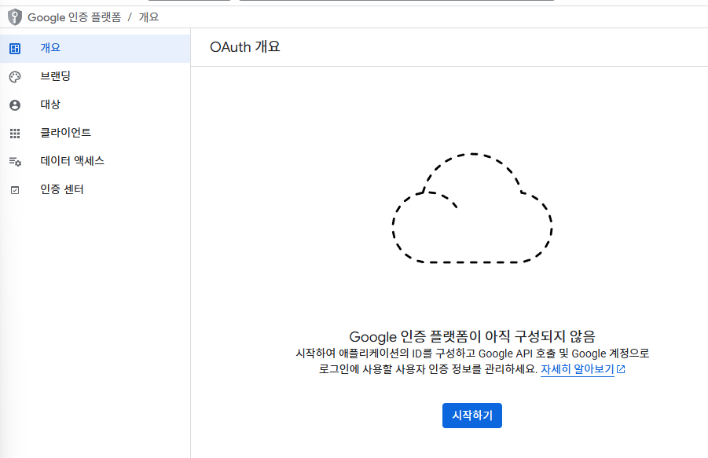
> 시작하기(파란버튼)
3. **앱 정보 입력**:
   - **App name**: n8n
   - **User support email**: 사용자 지원 이메일
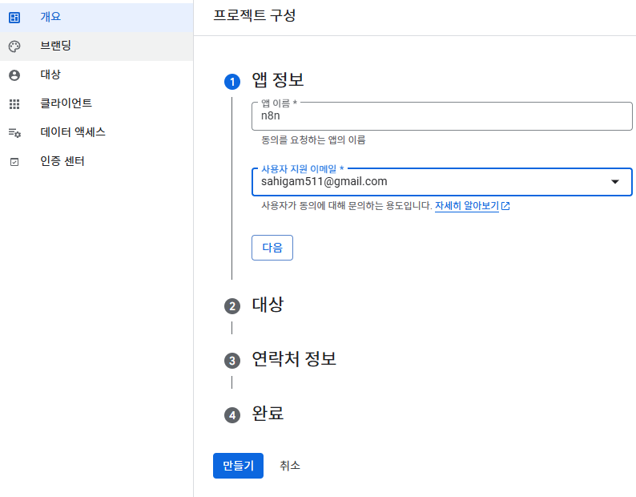
> 이메일주소를 입력후 다음
4. **Audience 선택**:
   - **Internal**: 조직 내 Google Workspace 사용자만 접근
   - **External**: 모든 Google 계정 사용자 접근
  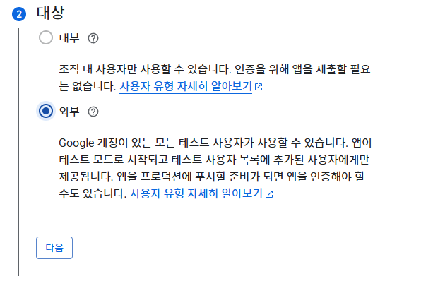
> 외부로 설정후 다음

5. **연락처 정보**: 프로젝트 변경 시 Google이 연락할 이메일 주소
  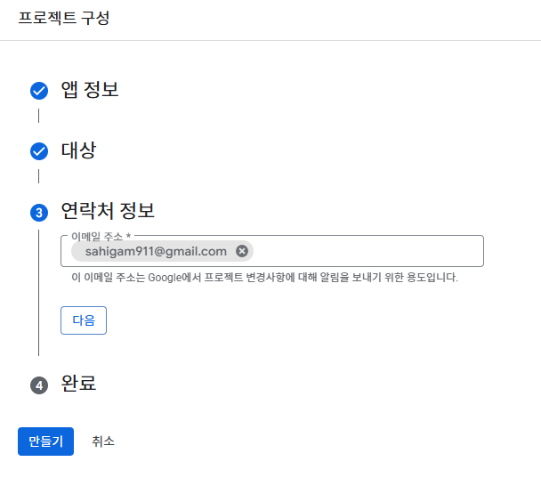
> 위의 이메일주소와 같아도 됨
6. Google's User Data Policy 동의 후 **Create** 클릭
  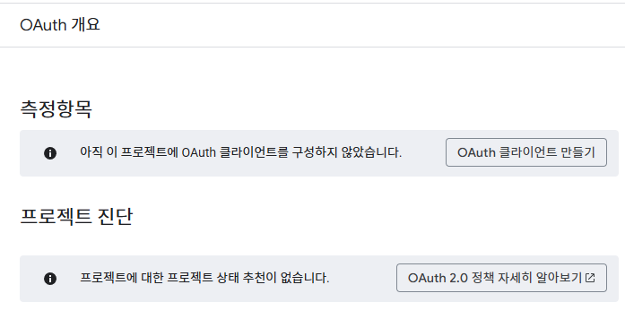
> OAuth클라이언트만들기를 클릭하여 단계4로 넘어가자!

#### 🔑 단계 4: OAuth 클라이언트 자격 증명 생성
- 클라이언트에서 호출할 때, 키를 줄까 말까? 권한을 정해주는 단계입니다
1. `APIs & Services > Credentials` 이동
  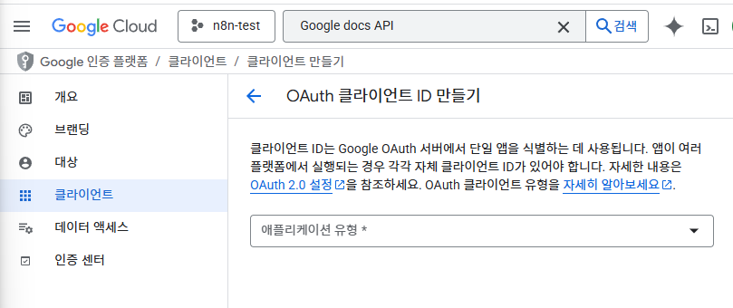
> 
2. **+ Create credentials > OAuth client ID** 선택
3. **애플리케이션 유형**: **Web application** 선택
4. **이름**: Google이 자동 생성한 이름을 인식 가능한 이름으로 변경
  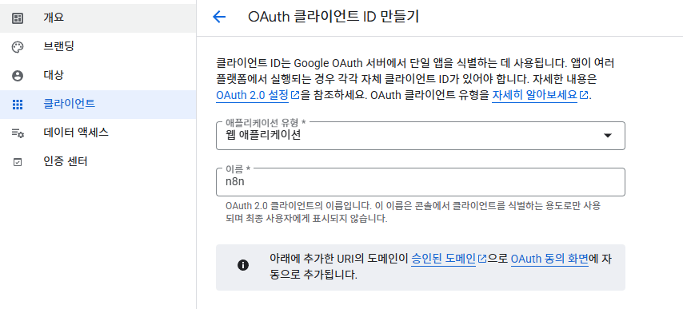
  > 귀찮아서 애플리케이션 이름은 n8n이라 설정
5. **Authorized redirect URIs 설정**:
   - n8n credential에서 **OAuth Redirect URL** 복사
   - Self-hosted n8n instances의 경우:
     ```
     http://localhost:5678/rest/oauth2-credential/callback
     ```
   - Google Console의 **Authorized redirect URIs**에 붙여넣기
     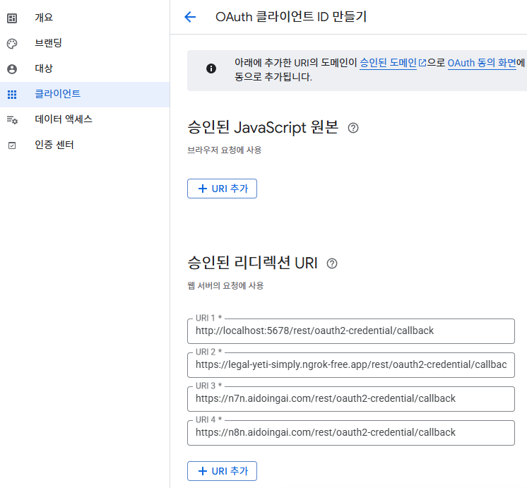
  > 구글 인증에 접속할 도메인을 모두 넣습니다. 만들기 후 생성까지 5분 소요
6. **Create** 클릭

7. **브랜딩 설정**:
   - 좌측 메뉴에서 **Branding** 선택
   - **Authorized domains** 섹션에서 **Add domain** 클릭
   - 도메인 추가:
     - 자체 호스팅 시: n8n 인스턴스 도메인
 페이지 하단 **Save** 클릭
     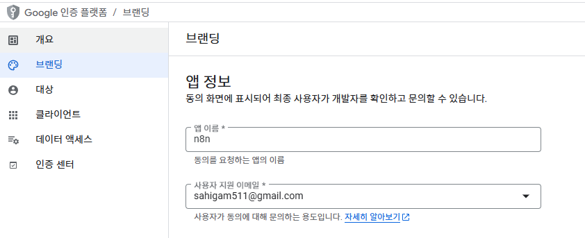
  > 앱정보 입력 후 저장, 앱개시
8. 대상에서 사용자 이메일주소 입력
 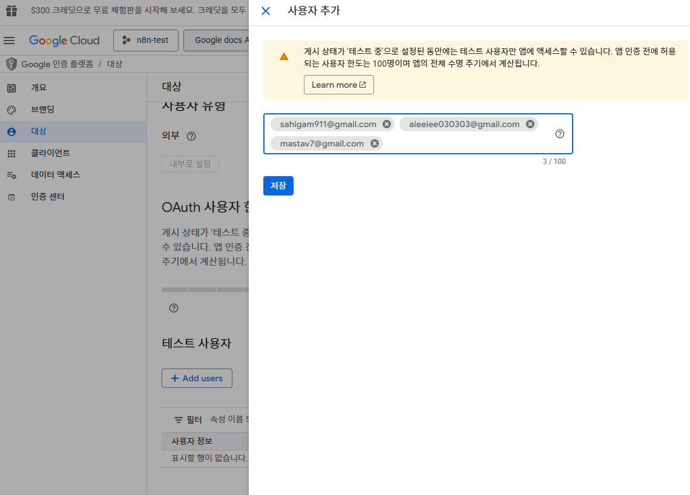
  > 인증을 진행할 주소를 입력후 저장
#### ✨ 단계 5: n8n credential 완성
 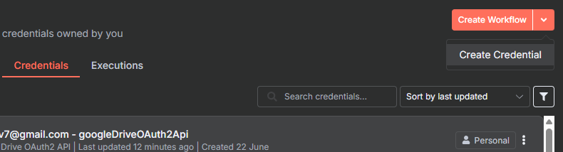
 > 로그인 후 Create Credential 진행
1. **Client ID 설정**:
   - *Google Drive OAuth2 API 선택
    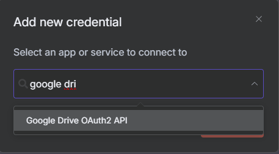
   -**Client ID** 복사 후 
   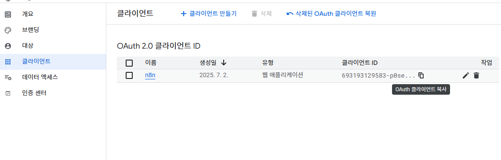
   - n8n credential의 Client ID *에 입력
    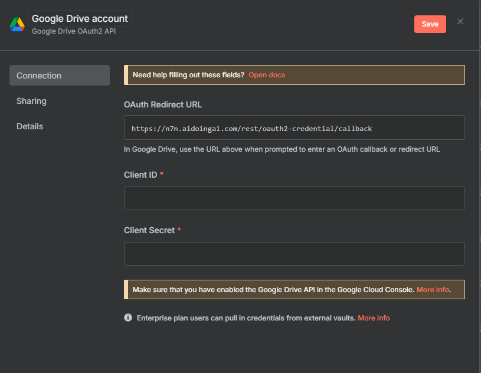
2. **Client Secret 설정**:
   - Client Secret *은 클라이언트 클릭 후 우측에 복사하여 붙여넣기 (전체화면에서 보임)
    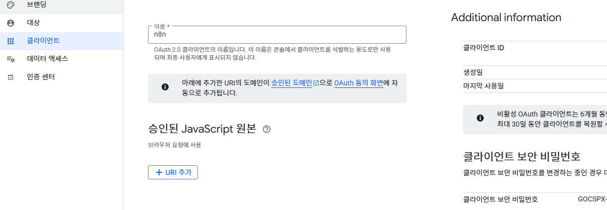
   - n8n credential에 입력
3. **Scopes 설정**: (보통은 자동으로 입력되어 있음)
   - 필요한 scopes를 스페이스로 구분하여 입력
   - 예시: 
     ```
     https://www.googleapis.com/auth/gmail.labels https://www.googleapis.com/auth/gmail.addons.current.action.compose
     ```
4. **인증 완료**:
   - n8n에서 **Sign in with Google** 클릭
   - Google 인증 프로세스 완료
5. **저장**: 새 credentials 저장
6. 이후 로그인하여 인증을 마무리
   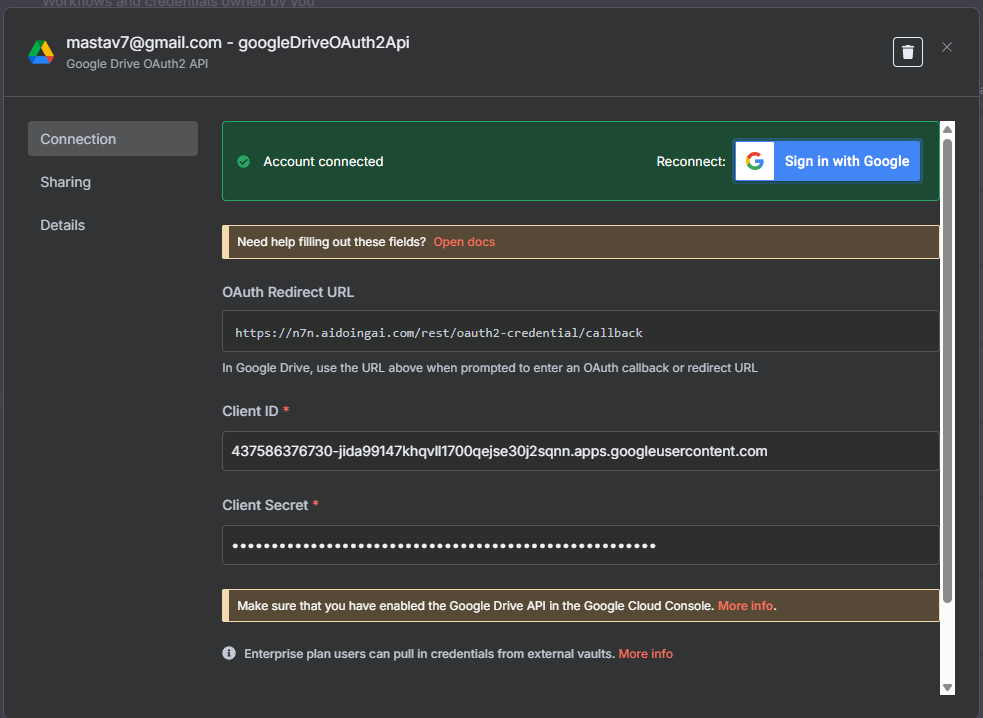
   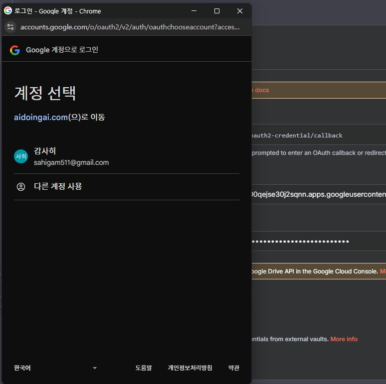
   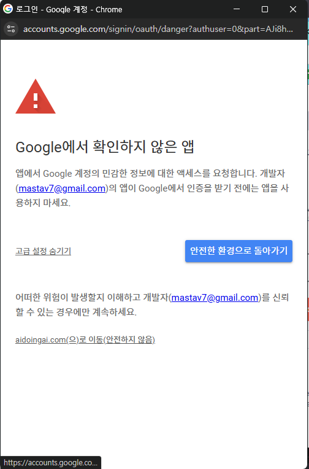
   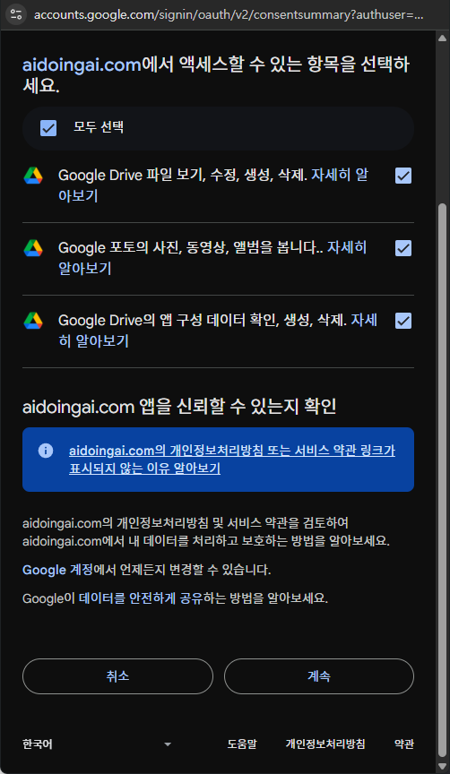
   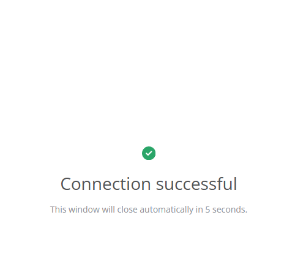

7. https://drive.google.com/drive 에서 폴더를 생성하고 
8. n8n에서 google drive trigger로 확인해봅니다.
---

## 💡 팁 및 주의사항

### 🔧 일반적인 문제 해결
1. **Redirect URI 오류**: n8n에서 제공하는 정확한 OAuth Redirect URL 사용
2. **Scope 권한 오류**: 필요한 모든 scopes가 올바르게 설정되었는지 확인
3. **API 비활성화 오류**: Google Cloud Console에서 해당 API가 활성화되었는지 확인

---

## 📚 추가 참고자료
- [n8n Google OAuth 공식 문서](https://docs.n8n.io/integrations/builtin/credentials/google/oauth-generic/)
- [Google OAuth 2.0 Scopes](https://developers.google.com/identity/protocols/oauth2/scopes)
- [Google Cloud Console](https://console.cloud.google.com/)

---

**📅 작성일**: 2025년 7월 2일
**🔄 최종 업데이트**: 2025년 7월 2일
**📝 작성자**: 일하는 ai
