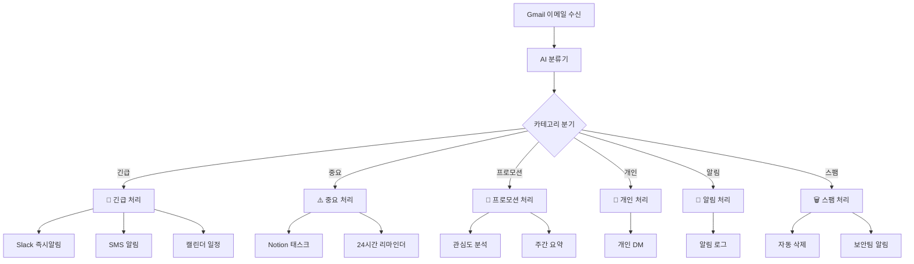

# 📧 이메일 자동분류봇 - n8n 워크플로우

> Gmail 연동 + AI 분류 + 스마트 알림 시스템

## 🎯 프로젝트 개요

이메일 자동분류봇은 **n8n**을 기반으로 한 지능형 이메일 관리 시스템입니다. AI를 활용하여 받은 편지함의 이메일을 자동으로 분류하고, 각 카테고리에 맞는 최적화된 처리 흐름을 제공합니다.

### 🌟 주요 기능

- **🤖 AI 기반 자동 분류**: OpenAI GPT 모델을 사용한 정확한 이메일 분류
- **⚡ 실시간 처리**: Gmail 트리거를 통한 즉시 처리
- **📱 다채널 알림**: Slack, SMS, 캘린더 등 다양한 알림 방식
- **📊 인텔리전트 분석**: 카테고리별 맞춤형 분석 및 처리
- **🛡️ 보안 강화**: 스팸/피싱 탐지 및 자동 차단
- **📈 통계 및 리포팅**: 주간/월간 이메일 사용 패턴 분석

## 🏗️ 시스템 아키텍처



## 📂 워크플로우 구조

### 1. 메인 워크플로우
- **파일**: `01_email_auto_classifier.json`
- **기능**: Gmail 트리거 → AI 분류 → 카테고리별 라우팅

### 2. 카테고리별 처리 워크플로우

| 카테고리 | 파일명 | 주요 기능 |
|---------|--------|----------|
| 🚨 긴급 | `02_urgent_handler.json` | 즉시 알림, SMS, 캘린더 일정 생성 |
| ⚠️ 중요 | `03_important_handler.json` | Notion 태스크, 24시간 리마인더 |
| 📢 프로모션 | `04_promotional_handler.json` | 키워드 분석, 주간 요약, 자동 아카이브 |
| 👤🔔 개인/알림 | `06_personal_notification_handler.json` | 개인 DM, 알림 추적 |
| 🗑️ 스팸 | `05_spam_handler.json` | 자동 삭제, 피싱 탐지, 보안 알림 |

## 🚀 설치 및 설정

### 1. 사전 요구사항

- **n8n 인스턴스** (Cloud 또는 Self-hosted)
- **Gmail 계정** (API 접근 권한)
- **OpenAI API 키**
- **Slack 워크스페이스** (옵션)

### 2. 워크플로우 임포트

```bash
# 1. 워크플로우 파일들을 n8n에 임포트
# n8n 웹 인터페이스에서 각 JSON 파일을 임포트

# 2. 환경 변수 설정
# environment-variables.md 파일 참조하여 모든 변수 설정

# 3. 자격 증명 설정
# 각 외부 서비스별 OAuth 및 API 키 설정
```

### 3. 세부 설정 가이드

자세한 설정 방법은 [`environment-variables.md`](./environment-variables.md) 파일을 참조하세요.

## 📋 이메일 분류 카테고리

### 🚨 긴급 (Urgent)
- **기준**: 즉각적인 확인과 조치가 필요한 이메일
- **예시**: 서버 장애, 긴급 회의, 고객 클레임
- **처리**: Slack 즉시 알림 + SMS + 캘린더 일정

### ⚠️ 중요 (Important)  
- **기준**: 빠른 시일 내 확인이 필요한 업무 이메일
- **예시**: 주간 보고, 업무 협의, 미팅 팔로업
- **처리**: Notion 태스크 생성 + 24시간 리마인더

### 📢 프로모션 (Promotional)
- **기준**: 뉴스레터, 광고, 마케팅 메일
- **예시**: 할인 정보, 이벤트 안내, 서비스 소개
- **처리**: 키워드 분석 + 관심도 평가 + 주간 요약

### 👤 개인 (Personal)
- **기준**: 친구, 가족, 지인과의 사적인 대화
- **예시**: 개인적인 안부, 약속 잡기, 사적인 상담
- **처리**: 개인 DM 알림 + 감정 분석

### 🔔 알림 (Notification)
- **기준**: 서비스 가입, 결제, 배송 등 시스템 알림
- **예시**: 결제 완료, 배송 안내, 계정 보안
- **처리**: 자동 아카이브 + 월간 통계

### 🗑️ 스팸 (Spam)
- **기준**: 불필요한 광고, 피싱 시도 등
- **예시**: 피싱 메일, 악성 링크, 사기 메일
- **처리**: 자동 삭제 + 필터 생성 + 보안팀 알림

## 🎛️ AI 프롬프트 최적화

### 시스템 프롬프트 특징

본 시스템의 AI 분류기는 **Prompting Engineering Guide** 원칙을 적용하여 설계되었습니다:

1. **명확한 페르소나 정의**: "AI 이메일 분류 에이전트" 역할 명시
2. **구조화된 지시사항**: 단계별 처리 방법 정의
3. **정확한 출력 형식**: JSON 스키마 강제
4. **예외 처리**: 파싱 실패시 fallback 로직

### 분류 성능 향상 팁

- **커스텀 키워드 추가**: 조직 특성에 맞는 키워드 설정
- **학습 데이터 축적**: 분류 결과를 기반으로 모델 개선
- **임계값 조정**: 긴급도 점수 기준 조정

## 📊 모니터링 및 분석

### 실시간 모니터링

- **Slack 채널**: 각 카테고리별 전용 채널에서 실시간 확인
- **n8n 실행 로그**: 워크플로우 실행 상태 및 오류 추적
- **외부 모니터링**: Webhook을 통한 외부 시스템 연동

### 정기 리포트

- **주간 프로모션 요약**: 매주 금요일 5PM
- **월간 알림 통계**: 매월 말일 6PM
- **스팸 탐지 현황**: 실시간 보안팀 알림

## 🔧 커스터마이징

### 분류 카테고리 추가

1. 메인 워크플로우의 Switch 노드에 새 조건 추가
2. 새로운 처리 워크플로우 생성
3. AI 프롬프트에 새 카테고리 정의 추가

### 알림 채널 확장

- **Discord**: Slack 대신 Discord 사용
- **Teams**: Microsoft Teams 연동
- **이메일**: SMTP를 통한 이메일 알림
- **Webhook**: 커스텀 시스템 연동

### 분석 로직 개선

- **감정 분석**: 더 정교한 감정 인식
- **발신자 분석**: 화이트리스트/블랙리스트 관리
- **시간대 분석**: 시간대별 우선순위 조정

## 🛡️ 보안 및 개인정보

### 데이터 보호

- **최소 권한 원칙**: 필요한 Gmail 스코프만 요청
- **로그 관리**: 민감한 이메일 내용은 로그에서 제외
- **암호화**: API 키 및 토큰의 안전한 저장

### 개인정보 처리

- **데이터 최소화**: 분류에 필요한 최소한의 정보만 처리
- **보존 기간**: 로그 데이터의 자동 삭제 정책
- **접근 제어**: 관리자만 민감한 워크플로우 접근 가능

## 🔄 업데이트 및 유지보수

### 정기 업데이트 사항

- **AI 모델 업그레이드**: 최신 OpenAI 모델 적용
- **보안 패치**: n8n 및 종속성 업데이트
- **성능 최적화**: 워크플로우 실행 속도 개선

### 장애 대응

- **백업 계획**: 워크플로우 백업 및 복원 절차
- **장애 감지**: 모니터링을 통한 조기 감지
- **수동 복구**: 자동화 실패시 수동 처리 방법

## 📞 지원 및 문의

### 문제 해결

1. **로그 확인**: n8n 실행 로그에서 오류 메시지 확인
2. **환경 변수**: 모든 필수 변수가 올바르게 설정되었는지 확인
3. **자격 증명**: API 키 및 OAuth 토큰의 유효성 확인
4. **권한**: 각 서비스별 API 권한 및 스코프 확인

### 기술 지원

- **GitHub Issues**: 버그 리포트 및 기능 요청
- **커뮤니티**: n8n 커뮤니티 포럼 활용
- **문서**: 공식 n8n 문서 참조

---

## 📄 라이선스

이 프로젝트는 MIT 라이선스 하에 배포됩니다. 자세한 내용은 LICENSE 파일을 참조하세요.

## 🙏 기여하기

프로젝트 개선에 기여하고 싶으시다면:

1. Fork 생성
2. Feature 브랜치 생성 (`git checkout -b feature/amazing-feature`)
3. 변경사항 커밋 (`git commit -m 'Add amazing feature'`)
4. 브랜치에 Push (`git push origin feature/amazing-feature`)
5. Pull Request 생성

---

**📧 이메일 자동분류봇**으로 더 스마트한 이메일 관리를 경험해보세요! 🚀 